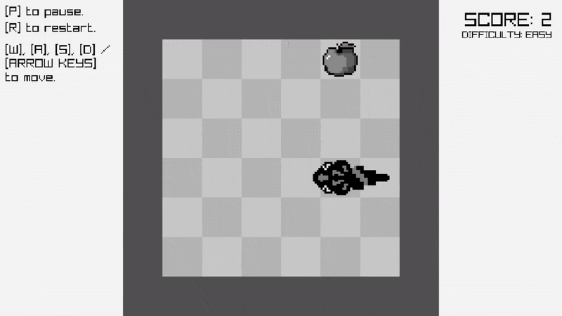
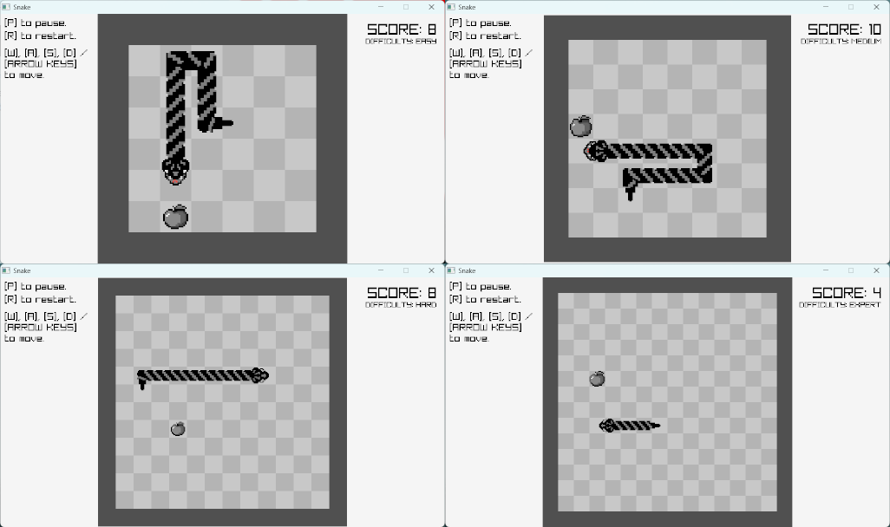

<h1>🐍 Snake Game in C</h1>

A classic Snake game written in C, with animations, sounds, and smooth user input with input buffering for a better gameplay experience. 
Created in first year at UWE for my principals of programming module.

<h2>🎮 Demo</h2>

  <h4>Gameplay</h4>
   
  <h4>Win State</h4>
   
  <h4>Difficulties</h4>
  

<h2>Features</h2>

<ul>
  <li>Responsive sprite sheet pixel art animations, including snake biting and death animations.</li>
  <li>Sound effects for button clicks, end of game, snake eating, and more.</li>
  <li>Input buffering for smooth and responsive controls.</li>
  <li>Score tracking and 4 levels of difficulty which increases the speed of the snake and the size of the playable area.</li>
  <li>Cross-platform C code (Windows executable provided)</li>
</ul>

<h2>🚀 Running the Game</h2>

Download the latest release: 
<a href="https://github.com/Aaron-Antal-Bento/snake-game/releases">SnakeGame.zip</a> 
(this includes <code>Snake.exe</code> along with a <code>resources</code> folder).

Extract the files from the .zip and ensure both <code>Snake.exe</code> and the <code>resources</code> folder are in the same directory.

Double-click <code>Snake.exe</code> to play!

